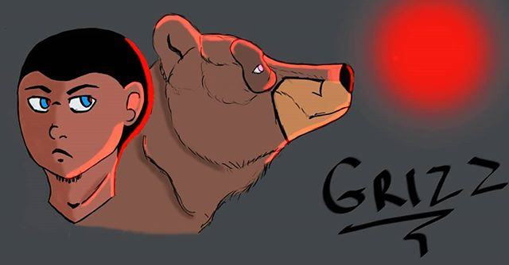
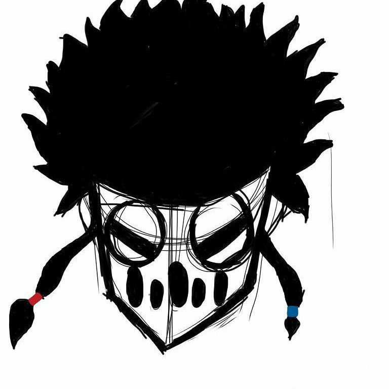
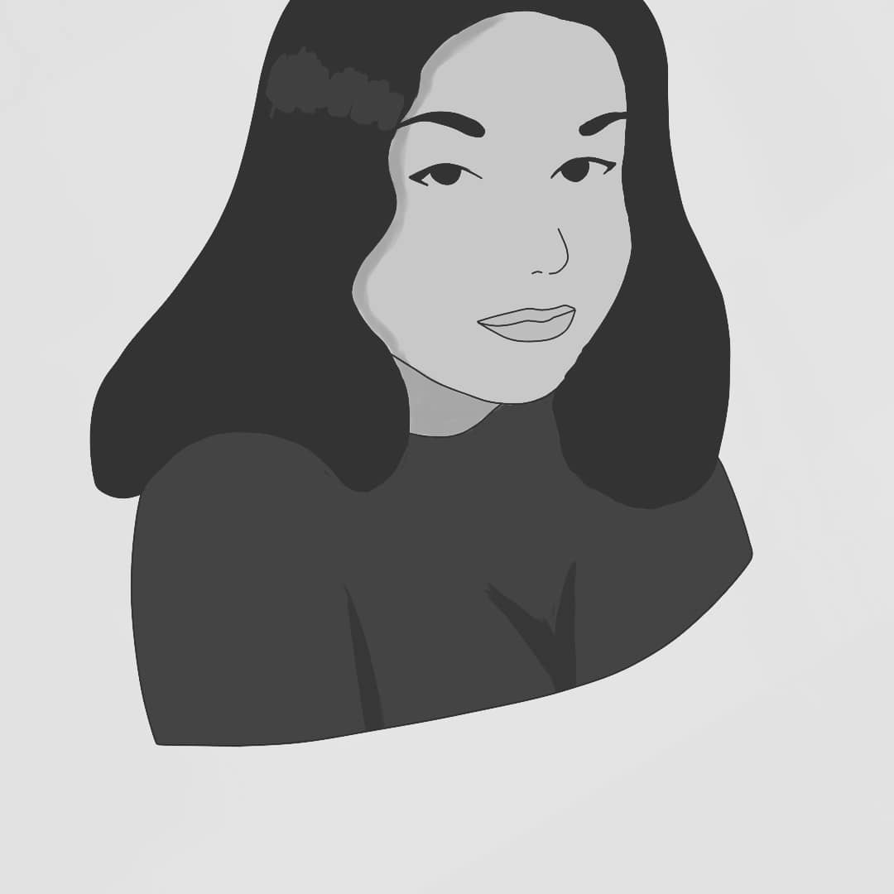
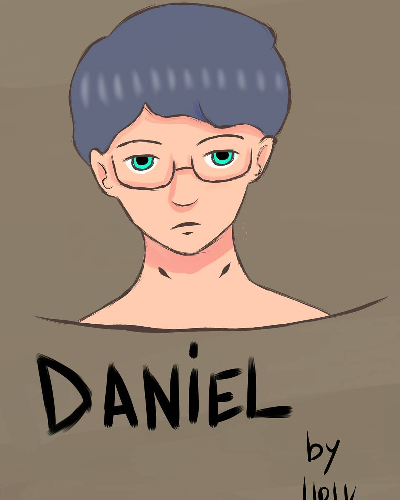
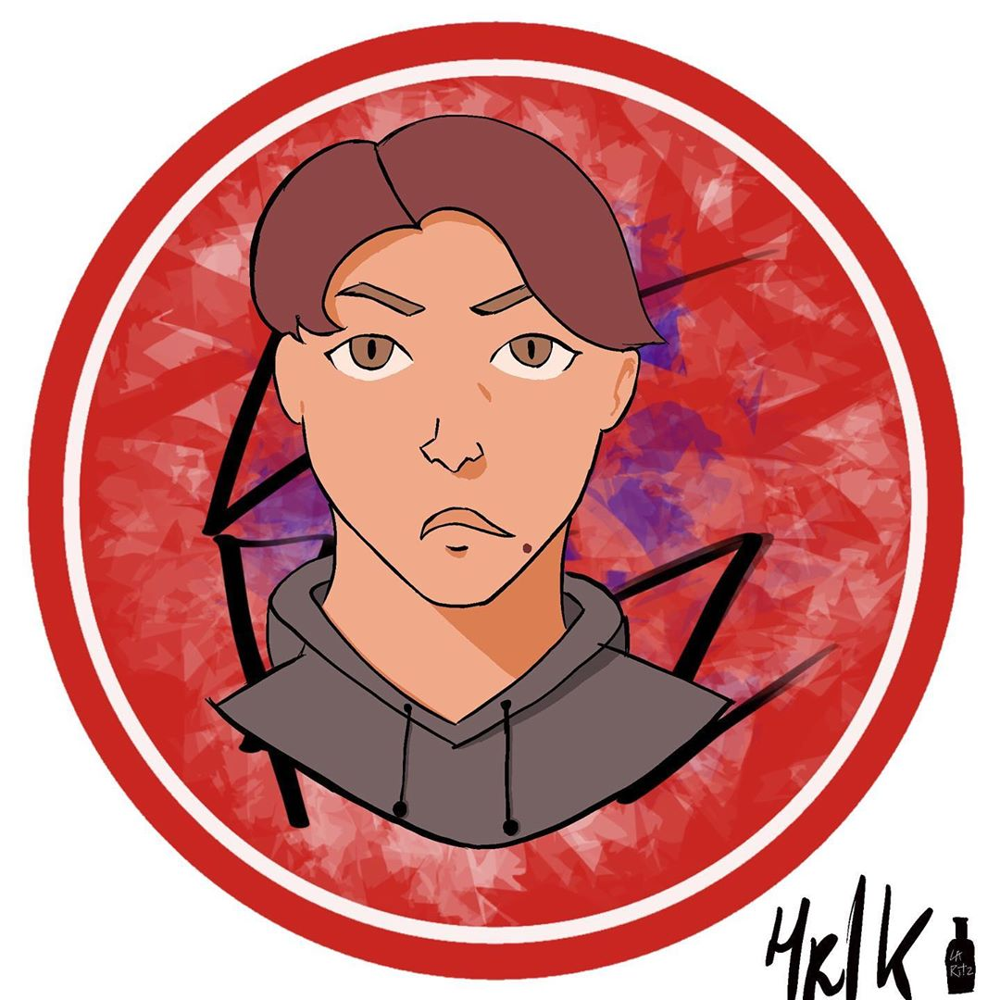
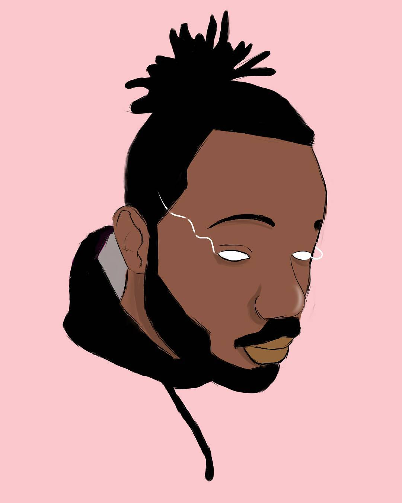
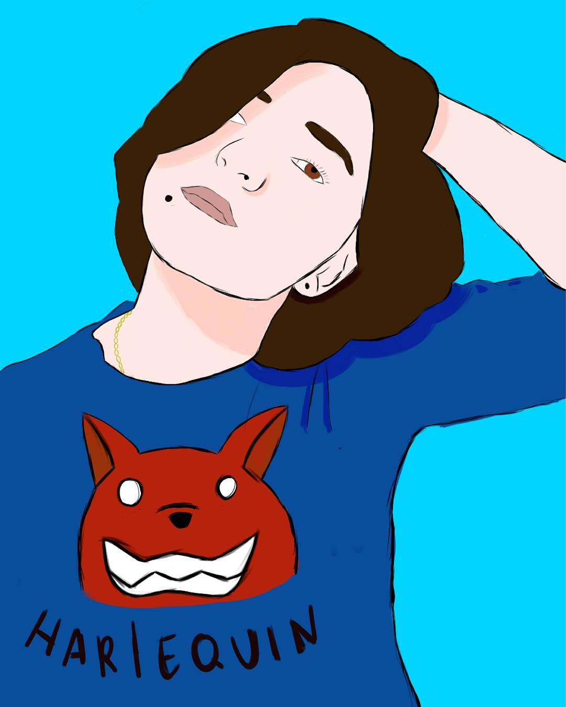

# Salayna 

## Who Am I ?

French🇫🇷 Based Student currently learning Mobile Developement and IoT but I have a bg crush on Backend Developement.  
Newly wed(Yep at 22), I decided that NodeJs would be my second Wife(Sorry babe I love you tho ! ❤️)
I first started IT at the age of 8 with a decent windows XP computer when I was living in Senegal with my cousin who was an IT student. But I stopped for a long time and was mostly doing anything else but IT. But starting High School I got back to it for whatever reason and Fell in Love again and since, I never really Stopped.

## Work Experience

* **Mobile Developper at STSISI(Technical Section French Ministry of Interior)**  
  * Making and Maintaining an Android App
  * Network and System Administration
  * Backend devloping for testing purpose

* **Network and System Administartor and Web DEvelopper at Calysta (internship)**
  * Developping a Website and and e-learning website(Using Moodle)
  * Setup the servers and Sytems for the Website
  
## School Experience

 * **Diploma in Digitals Systems: It and Networks**
   * C/C++ Development 
   * NodeJS
   * Basis of Networks
   * Linux Systems Administration
   
 ## Other Stuffs about Me
  ### Used To Draw a lot
  Here is some the Artwork I've done in the past
  
  
  
  
  
  
  
    
  

<!--
**Salayna/Salayna** is a ✨ _special_ ✨ repository because its `README.md` (this file) appears on your GitHub profile.

Here are some ideas to get you started:

- 🔭 I’m currently working on ...
- 🌱 I’m currently learning ...
- 👯 I’m looking to collaborate on ...
- 🤔 I’m looking for help with ...
- 💬 Ask me about ...
- 📫 How to reach me: ...
- 😄 Pronouns: ...
- ⚡ Fun fact: ...
-->
